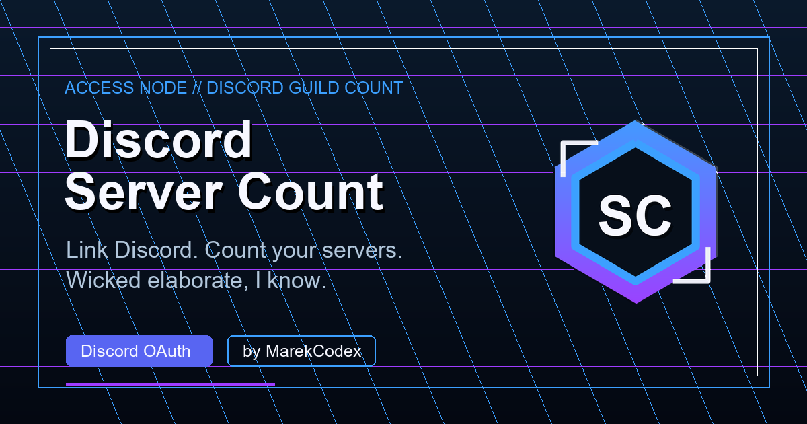
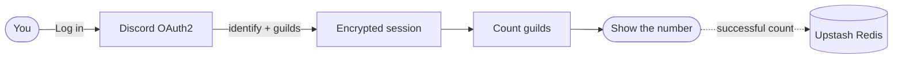

<div align="center">

# Discord Server Count

**One question. One OAuth flow. One number.**

[](https://discord-server-count.vercel.app)




</div>

Discord Server Count is a deliberately tiny web app that tells you how many
Discord servers your account belongs to.

No account system. No settings maze. No dashboard-industrial complex quietly
assembling a council in the next room. Discord hands over the guild list, the
app counts it, and you get the number.

## How It Works



1. You sign in through Discord OAuth.
2. Discord returns your basic profile and guild list.
3. The server counts the guilds.
4. The browser receives your profile and the count—not the guild list.

Wicked elaborate, I know.

## Privacy

The app requests only Discord's `identify` and `guilds` scopes.

- Your password, messages, and billing information are never requested.
- OAuth data lives in an encrypted, HTTP-only session cookie.
- The guild list is counted on the server and is not sent to the browser.
- Redis stores one aggregate statistic: the number of counts generated.
- There is no user-account database.

## Architecture

```text
src/
├── app/          Pages and HTTP route handlers
│   ├── api/      User and aggregate-stat APIs
│   ├── callback/ Discord OAuth callback
│   ├── dashboard Result page
│   ├── login/    OAuth entry point
│   └── logout/   Session cleanup
├── components/   Small interactive React components
└── lib/          Discord, session, configuration, and stats logic

public/           Static icons, manifest, robots, sitemap, and social card
scripts/          Reproducible icon and social-card generators
```

The file count is mostly framework convention: each public URL has an obvious
home. Business logic stays out of route handlers, interactive behavior stays
out of server components, and deployment needs no custom server adapter.

## Stack

| Concern | Choice |
| --- | --- |
| Framework | Next.js App Router |
| UI | React |
| Language | TypeScript |
| Authentication | Discord OAuth2 |
| Session | AES-256-GCM encrypted cookie |
| Aggregate stats | Upstash Redis |
| Hosting | Vercel |

## Run Locally

Requirements:

- Node.js 20.9 or newer
- A Discord application
- Redis is optional; development falls back to `data/stats.json`

Add this redirect URI in the
[Discord Developer Portal](https://discord.com/developers/applications):

```text
http://localhost:3000/callback
```

Copy `.env.example` to `.env.local`, then fill in:

```env
DISCORD_CLIENT_ID=your_client_id
DISCORD_CLIENT_SECRET=your_client_secret
DISCORD_REDIRECT_URI=http://localhost:3000/callback
SESSION_SECRET=replace_with_a_long_random_secret
NODE_ENV=development
KV_REST_API_URL=
KV_REST_API_TOKEN=
```

```bash
npm install
npm run dev
```

Open [localhost:3000](http://localhost:3000).

## Quality Checks

```bash
npm run check   # TypeScript + ESLint
npm run build   # Production build
```

## Regenerate Assets

The committed icons and social card are reproducible:

```bash
npm run icons
npm run social
npm run assets
```

The scripts require Python and Pillow.

## Deploy

Vercel detects Next.js automatically. Production needs:

- `DISCORD_CLIENT_ID`
- `DISCORD_CLIENT_SECRET`
- `DISCORD_REDIRECT_URI`
- `SESSION_SECRET`
- `KV_REST_API_URL`
- `KV_REST_API_TOKEN`

The production callback URL must also be registered in Discord:

```text
https://discord-server-count.vercel.app/callback
```

## Credit

Inspired by
[NobreHD/Discord-Server-Count](https://github.com/NobreHD/Discord-Server-Count),
with a different stack and a mildly suspicious access-node coat of paint.
